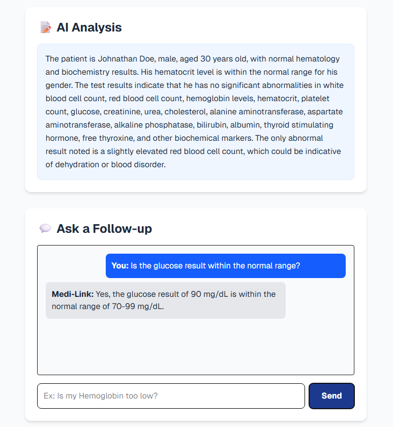

# 🏥 Medi-Link: Autonomous Multi-Agent Health Intelligence Platform

> **Transforming messy, unstructured medical reports into actionable, personalized health insights using Agentic RAG and Recursive Chunking.**

---

## 📖 Overview

**Medi-Link** is an end-to-end AI system designed to bridge the gap between complex medical data and patient understanding. It ingests raw medical documents (PDFs/Images), digitizes them using OCR, and utilizes a **Multi-Agent RAG System** to provide safe, context-aware health summaries.

Built with **privacy** and **accuracy** in mind, it uses **Qdrant** for vector memory and **Qwen2.5-1.5B-Instruct** for reasoning, ensuring that patients receive intelligible summaries backed by verified medical context, minimizing LLM hallucinations.

---

## 🏗️ Key Engineering Highlights

### 1. 👁️ Intelligent Ingestion & Recursive Chunking

Medical documents are highly sensitive to context. To solve the "Messy Data" problem:

- **OCR Pipeline:** Utilizes **Tesseract OCR** to extract text and tabular data from scanned images.
- **Recursive Character Splitting:** Implemented a chunking strategy with a **1000-character window and 200-character overlap**. This ensures that clinical markers (e.g., "Hemoglobin") stay semantically linked to their values and reference ranges across vector boundaries.

### 2. 🧠 Vector Retrieval-Augmented Generation (RAG)

- **Vector Database:** **Qdrant** (running via Docker) manages high-dimensional embeddings.
- **Semantic Retrieval:** Uses `sentence-transformers/all-mpnet-base-v2` to perform Cosine Similarity searches, grounding the AI's responses in verified medical guidelines.
- **Multi-Collection Architecture:** Separate collections for **Medical Knowledge** (General Guidelines) and **Patient Data** (Specific Reports) ensure structured retrieval.

### 3. 🤖 Declarative Multi-Agent Workflows (LCEL)

The project utilizes **LangChain Expression Language (LCEL)** to build a modular agentic pipeline:

- **Agent 1 (The Analyst):** Interprets lab results against retrieved medical context.
- **Agent 2 (The Chat Assistant):** Provides conversational Q&A based on the patient's specific history.
- **Design Pattern:** By using LCEL (`Prompt | LLM | StrOutputParser`), the system is decoupled, allowing for easy model swapping or prompt versioning without touching the core logic.

---

## 🛠️ Tech Stack

### **Frontend**

- **Framework:** Next.js 14 (App Router)
- **State Management:** React Hooks (useState/useEffect)
- **Styling:** Tailwind CSS

### **Backend (AI Microservice)**

- **Framework:** FastAPI (Python)
- **Orchestration:** LangChain Core & LangChain-HuggingFace
- **Vector DB:** Qdrant (Docker)
- **Model:** `Qwen/Qwen2.5-1.5B-Instruct` (Conversational Task)
- **OCR:** Pytesseract / PIL

---
